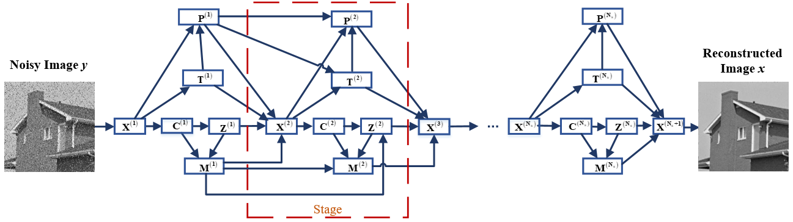
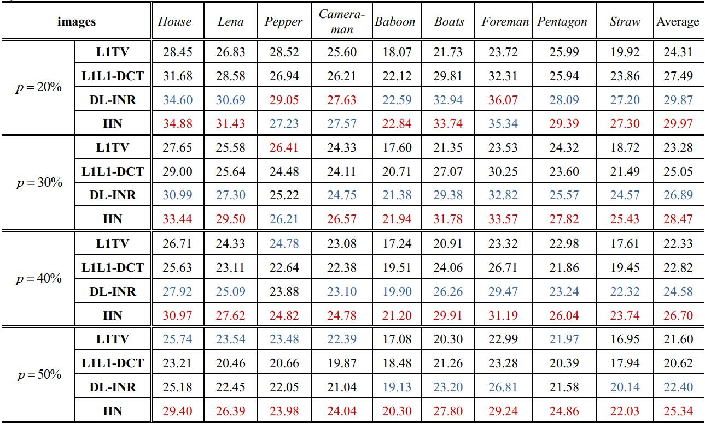
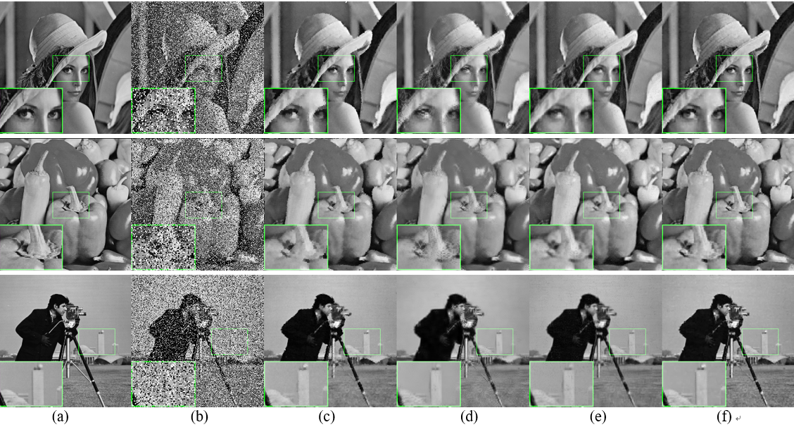

# IIN-Code
Iterative-scheme Inspired Network for Impulse Noise Removal  
## About The Code
This is a demo Code based on the method described in the following paper:   
Iterative-scheme Inspired Network for Impulse Noise Removal, Journal of Pattern Analysis and Applications, 23(1): 135–145, 2020.  
Author: M. Zhang, Y. Liu, G. Li, B. Qin, Q. Liu.
Date : 11/2018  
Version : 1.0   
The code and the algorithm are for non-comercial use only.   
Copyright 2018, Department of Electronic Information Engineering, Nanchang University.   

## The Framework of IIN
   
 
## The Denoising Results
The PSNR (dB) results of L1TV, L1L1-DCT, DL-INR and IIN with p = 20%, 30%, 40%, 50%. Red color indicates the best performance and blue color indicates the second.  
   

 
A visual restoration comparison from noised image of p = 30%.  (a) Reference image, (b) Degraded image, (c-f) denoised results of L1-TV, L1L1-DCT, DL-INR and IIN.

## Other Related Projects
  * Variable augmented neural network for decolorization and multi-exposure fusion [**[Paper]**](https://www.sciencedirect.com/science/article/abs/pii/S1566253517305298)   [**[Code]**](https://github.com/yqx7150/DecolorNet_FusionNet_code)   [**[Slide]**](https://github.com/yqx7150/EDAEPRec/tree/master/Slide)
  
  * IFR-Net: Iterative Feature Refinement Network for Compressed Sensing MRI [**[Paper]**](https://ieeexplore.ieee.org/document/8918016)   [**[Code]**](https://github.com/yqx7150/IFR-Net-Code)

  * VST-Net: Variance-stabilizing transformation inspired network for Poisson denoising [**[Paper]**](https://www.sciencedirect.com/science/article/pii/S1047320319301439)   [**[Code]**](https://github.com/yqx7150/VST-Net)
  
  * A Comparative Study of CNN-based Super-resolution Methods in MRI Reconstruction and Its Beyond [**[Paper]**](https://sciencedirect.xilesou.top/science/article/abs/pii/S0923596519302358)   [**[Code]**](https://github.com/yqx7150/DCCN)  
 
  * Progressively distribution-based Rician noise removal for magnetic resonance imaging [**[Paper]**](http://archive.ismrm.org/2018/0773.html)   [**[Code]**](https://github.com/yqx7150/RicianNet)
